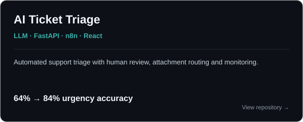
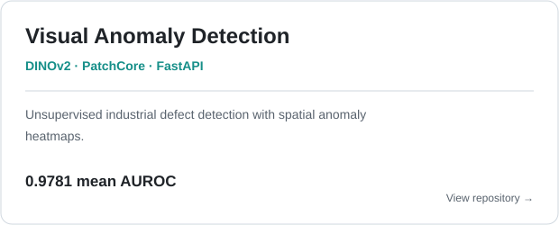
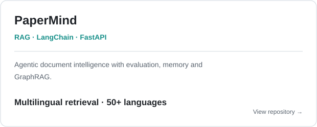
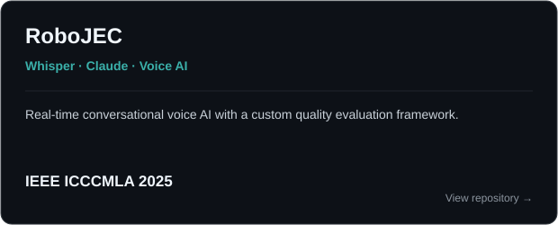

# Hi, I'm Devarshi 🙋🏻‍♂️

M.Sc. student in **Intelligent Interactive Systems at Universität Bielefeld** with a background in Artificial Intelligence and Data Science.

I build AI systems end to end, from training and evaluation to deployment and monitoring. I care about systems that work outside notebooks, produce outputs people can trust, and make failures measurable. Co-author at **IEEE ICCCMLA 2025**.

**[Portfolio →](https://devarshi-portfolio-sepia.vercel.app/)**

## Projects

<table>
<tr>
<td width="50%" valign="top">

</td>
<td width="50%" valign="top">

</td>
</tr>
<tr>
<td width="50%" valign="top">

</td>
<td width="50%" valign="top">

</td>
</tr>
</table>

## Tech Stack

### AI / ML

### LLM / NLP

### Backend & Data

### Frontend & Automation

### MLOps & Engineering

## Research

**Intelligent Conversational Brain RoboJEC**  
Co-author · IEEE ICCCMLA 2025 · **[View publication →](https://ieeexplore.ieee.org/document/11580747)**

---

<a href="https://devarshi-portfolio-sepia.vercel.app/">Portfolio</a> ·
<a href="https://www.linkedin.com/in/devarshi-dixit010/">LinkedIn</a> ·
<a href="mailto:devarshidixit01@gmail.com">Email</a>

