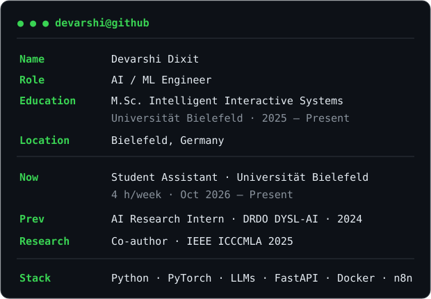
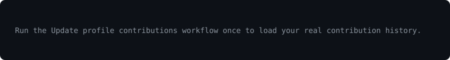

### `devarshi@github:~$ whoami`

<table><tr><td valign="top"></td><td valign="top"></td></tr></table>

### `devarshi@github:~$ ./projects.sh`

| Project | What it does | Stack |
|---|---|---|
| **[AI Ticket Triage](https://github.com/dixitdevarshi/ai-ticket-triage)** | Support-ticket classification, urgency evaluation, human review and monitoring. **Urgency accuracy: 64% → 84%.** | `Claude API` `FastAPI` `n8n` `PostgreSQL` `React` |
| **[Visual Anomaly Detection](https://github.com/dixitdevarshi/visual-anomaly-detection)** | Unsupervised industrial defect detection with spatial localization. **0.9781 mean AUROC across MVTec AD.** | `DINOv2` `PatchCore` `PyTorch` `MLflow` |
| **[PaperMind](https://github.com/dixitdevarshi/PaperMind)** | Multilingual RAG and document intelligence with custom evaluation. | `LangChain` `RAG` `FastAPI` `Prometheus` |
| **[RoboJEC](https://github.com/dixitdevarshi/RoboJEC)** | Real-time voice AI combining ASR, dialogue generation and speech synthesis. | `Whisper` `Claude` `Socket.IO` `Python` |

### `devarshi@github:~$ ./contributions.sh`

---

**AI / ML Engineer · M.Sc. Intelligent Interactive Systems**

[Portfolio](https://devarshi-portfolio-sepia.vercel.app/) · [LinkedIn](https://www.linkedin.com/in/devarshi-dixit010/) · [Email](mailto:devarshidixit01@gmail.com)

